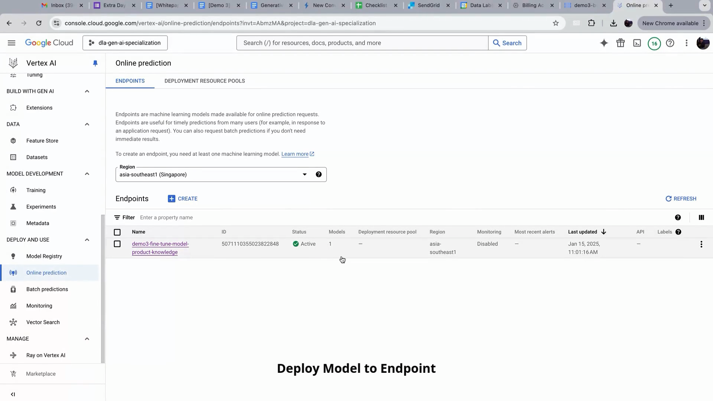

## Gen AI Finetuned Flipkart

**Package Dependencies**

*   <a href="https://www.python.org/downloads/">Python 3.11</a>
*   <a href="https://cloud.google.com/sdk?hl=en">Google Cloud SDK</a>
*   <a href="https://cloud.google.com/vertex-ai/docs/python-sdk/use-vertex-ai-python-sdk">Vertex AI Python SDK</a>
*   <a href="https://cloud.google.com/storage/docs/reference/libraries#client-libraries-install-python">Google Cloud Storage</a>
*   <a href="https://pandas.pydata.org/">Pandas</a>
*   <a href="https://numpy.org/">Numpy</a> 

**Introduction**

This README provides a step-by-step guide to fine-tuning a Generative AI model using Google Cloud Vertex AI. The goal is to enhance the model's performance for specific tasks by providing custom training data. We will be using Gemini 1.5 flash as a base model.

**Prerequisites**

*   A Google Cloud Platform (GCP) account
*   A GCP project set up with Vertex AI enabled
*   Familiarity with JSON / JSONL data format

**Prepare your Data**
* **Build training data example in JSON format.**

    *   Refer to documentation here <a href="https://cloud.google.com/vertex-ai/generative-ai/docs/models/tune-models">Vertex AI Documentation</a>
    *   Prepare data in the format of the JSON Lines (JSONL) format for Gemini models. 
    *   Here is our example data: 

**Start Vertex AI Fine-Tune Model**
* **Access Vertex AI from Google Cloud Console.**

    *   Search for Vertex AI in the console.
    *   Navigate to the Vertex AI Dashboard.
    *   Select Tuning from the side menu. 
*   **Create a new tuned model.**

    *   Click "Create tuned model" Button.

*   **Fill Model Detail**

    *   Enter a name for your model ("demo3-fine-tune-model-product-knowledge" for this example)
    *   Select Gemini 1.5 Flash as the base model
    *   Set Region to `asia-southeast1 (Singapore)`
    *   Click "Continue"
*  **Fill Tuning Setting**

    *   Number of epochs (leave as default)
    *   Learning rate multiplier (leave as default)
    *   Adapter size (leave as default)
    *   Click "Continue" 

*   **Choose tuning dataset.**

    *   You have two options here, choose upload file or use existing file. 
    *   Browse to select JSONL file
    *   We will also enable "Model validation"
    *   Click "Start Tuning" 

*   **Monitor the Tuning process**

    *   Click on the "demo3-fine-tune-model-product-knowledge" link. 
    *   Observe the metrics.
    *   After ~2 hours, fine-tune model should be successfully created. 

**Test model in Console**
* **Access Vertex AI Studio Chat**
   * Navigate to Vertex AI menu, and choose Chat from side menu
*   **Select the fine-tuned model**

    * Select the `demo3-fine-tune-model-product-knowledge` model and other option are default.
    *   Prompt the model and get the answer. 

**Test Model using Experiment Eval Task**
* **Create Evaluation Data**
    *   Prepare final_qa_val.jsonl file for evaluation.
    *   This file contains question and answer for the evaluation task.
* **Upload Evaluation Data to Cloud Storage**
    *   Upload `final_qa_val.jsonl` to the bucket. 

* **Run evaluation experiment using jupyter notebook**
    *   We have a notebook to run our evaluation task.
    *   `eval_task_demo3.ipynb` will perform evaluation using the evaluation dataset and the fine-tune model. 
    *   Run the code.
* **Observe the Experiment from the Vertex AI Console.**

   *   Navigate to Vertex AI menu, and choose Experiment from side menu
   *   Choose `demo3-pairwise-experiment-eval-fine-tuned-model`
   *   Wait until the experiment finished.
   *   You can view the result of the evaluation in Metrics tab. 

**Deploy Model to Endpoint**

*   **Access the Model Registry**

    *    Navigate to the Vertex AI menu, under “Deploy & Use”, select “Model Registry.”
    *    Set Region to `asia-southeast1 (Singapore)`
*   **Deploy the tuned model**

    *   Click on the `demo3-fine-tune-model-product-knowledge` link.
    *   Go to "Deploy & Test" tab.
    *   Click "Deploy to Endpoint"
    *   Choose create new endpoint
    *   Set `demo3-fine-tune-model-product-knowledge` name for endpoint
    *   Click "Deploy"
*  **Observe the endpoint deployment**

    *   Go to online prediction.
    *   You can see `demo3-fine-tune-model-product-knowledge` endpoint has been deployed. 

**Summary**

You have now successfully fine-tuned a Gen AI model, evaluated its performance, and deployed to an endpoint.
